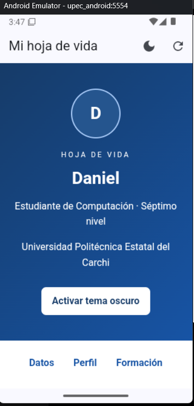
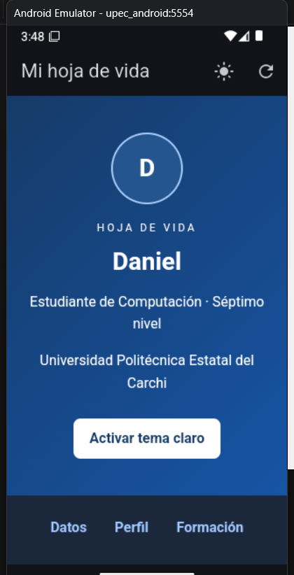
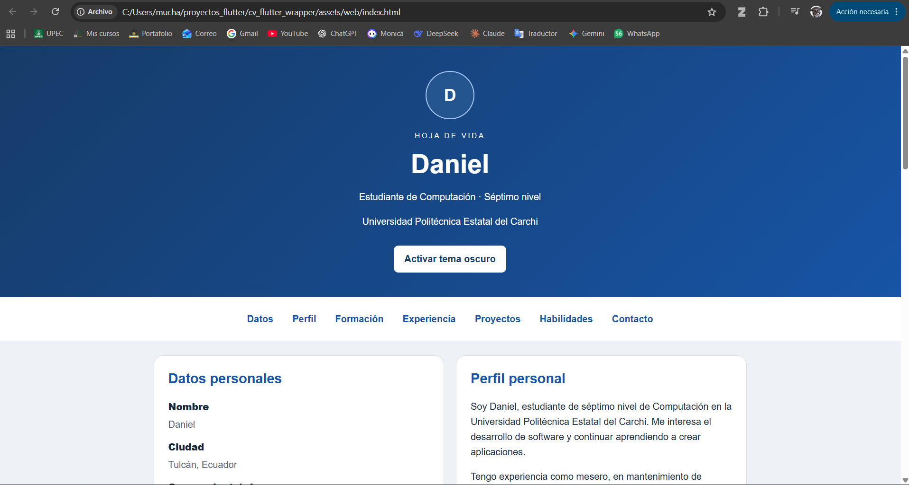

# Hoja de vida web integrada en Flutter

Universidad Politécnica Estatal del Carchi  
Carrera de Computación  
Asignatura: Desarrollo de Aplicaciones Móviles  
Docente: PhD. Samuel Lascano Rivera  
Estudiante: Daniel Enríquez
Nivel: 7mo nivel 

## Objetivo

Crear una hoja de vida web adaptable a distintos tamaños de pantalla
e integrarla dentro de una aplicación Android desarrollada con Flutter,
reutilizando el contenido HTML, CSS y JavaScript.

## Desarrollo

El proyecto se desarrolló en VS Code. Se utilizó HTML para organizar
la información de la hoja de vida, CSS para el diseño adaptable y
JavaScript para las interacciones.

Los archivos web se ubicaron en assets/web y se registraron en
pubspec.yaml. La aplicación Flutter utiliza WebView para mostrar
este contenido local. La interfaz móvil incorpora una barra superior
con controles para recargar y cambiar el tema.

Para ejecutar la aplicación se utilizó un emulador Android 16,
identificado como emulator-5554. Durante la configuración se
resolvieron problemas de conexión y carga del archivo index.html.
Finalmente se consiguió abrir la hoja de vida dentro de la aplicación.

## Organización del proyecto

- assets/web/: código HTML, CSS y JavaScript de la hoja de vida.
- lib/main.dart: código del contenedor Flutter.
- android/: configuración y archivos del proyecto Android.
- pubspec.yaml: dependencias y registro de los archivos locales.
- evidencias/: capturas de la ejecución.
- README.md: informe de la práctica.

## Ejecución

Desde la carpeta del proyecto:

    flutter pub get
    flutter emulators --launch upec_android
    flutter devices
    flutter run -d emulator-5554 --no-dds

El identificador del dispositivo puede cambiar en otro equipo.
Debe utilizarse el que aparezca en flutter devices.

La hoja de vida también puede abrirse directamente en un navegador
mediante el archivo assets/web/index.html.

## Resultados y evidencias

Se logró ejecutar la hoja de vida dentro del contenedor Flutter.
El contenido web y la aplicación móvil comparten los mismos
archivos de presentación.

### Aplicación Android en tema claro

### Aplicación Android en tema oscuro

### Hoja de vida en el navegador

## Comparación entre Android nativo y el contenedor híbrido

[Cuadro comparativo](evidencias/cuadro-comparativo.docx)

## Conclusiones

1. La integración permitió presentar una hoja de vida web dentro de
   una aplicación Android. Esto demuestra la reutilización del contenido
   web mediante un contenedor Flutter.

2. El enfoque híbrido permite mantener la presentación en los archivos
   HTML, CSS y JavaScript, mientras Flutter aporta los controles de la
   aplicación. Esta separación facilita localizar y modificar cada parte.

3. La comparación muestra diferencias de arquitectura y reutilización
   entre Android nativo y el enfoque híbrido. Para afirmar cuál ofrece
   mejor rendimiento sería necesario ejecutar ambas versiones en el
   mismo dispositivo y medirlas bajo las mismas condiciones.

## Referencias

- Flutter: https://docs.flutter.dev/
- Paquete webview_flutter: https://pub.dev/packages/webview_flutter
- MDN Web Docs: https://developer.mozilla.org/es/